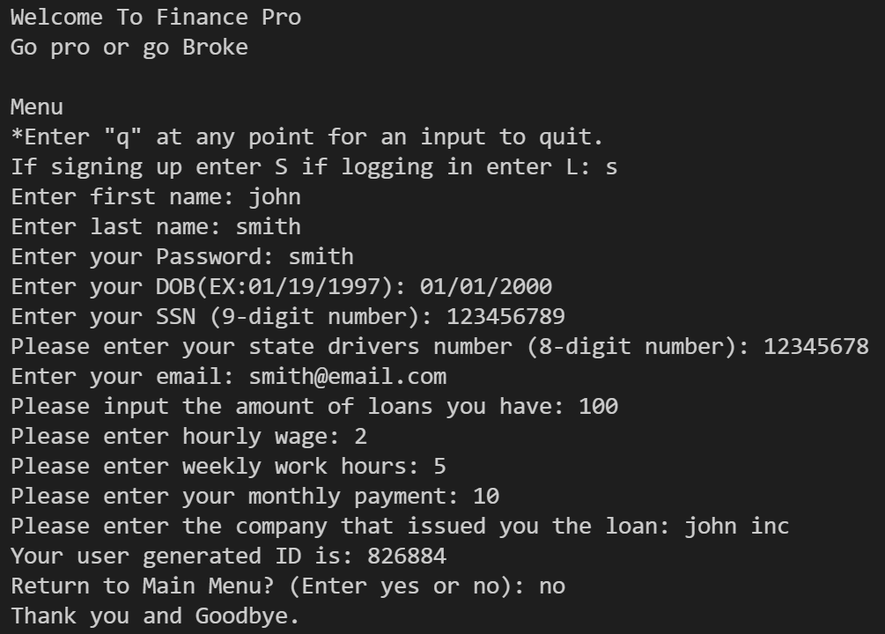

<!-- PROJECT LOGO -->
<br />
<p align="center">
  <a>
    
  </a>
  <h3 align="center">FinancePro</h3>
  <p align="center">
    Improving financial literacy using Python.
  </p>
</p>


<!-- TABLE OF CONTENTS -->
<details open="open">
  <summary>Table of Contents</summary>
  <ol>
    <li>
      <a href="#about-the-project">About The Project</a>
      <ul>
        <li><a href="#built-with">Built With</a></li>
      </ul>
    </li>
    <li>
      <a href="#getting-started">Getting Started</a>
      <ul>
        <!-- <li><a href="#prerequisites">Prerequisites</a></li> -->
        <li><a href="#installation">Installation</a></li>
      </ul>
    </li>
    <li><a href="#usage">Usage</a></li>
    <li><a href="#license">License</a></li>
    <li><a href="#contact">Contact</a></li>
    <li><a href="#acknowledgements">Acknowledgements</a></li>
  </ol>
</details>


<!-- ABOUT THE PROJECT -->
## About The Project

"For nearly 50 years, PIMCO has worked relentlessly to help millions of investors around the world pursue their financial goals while navigating market change. Their growing technology team plays a crucial role in that mission by building and improving applications that the firm uses to support their clients on the path to meeting their goals." For this challenge, our software development team aims to encourage good financial behavior and help to set individuals up for success in meeting their financial goals. We decided to focus on saving, investing, building credit, and overall improving financial literacy, combining the finance industry with technology.

Our team started developing the project as a way to improve financial literacy among young students and people who would like to educate themselves more. Each one of the team members tackled an important part of the program. Although there is a lot of room for improvement, our software tackles our main objectives as well implement a way to keep and store data from new and returning users. One unique feature the team learned was implementing a database structure which can contain and retrieve user information. Although our database system is a simple CSV file, we now have gained a fundamental understanding of how such a database structure can be applied to the real world. The project was mainly developed in the programming language known as Python. Some of the challenges the team faced included organization and communication. Some members among our group are new users to the GitHub software and thus have learned new material that will be incredibly useful in their careers. Overall, this Hackathon has been a great experience and has helped each of us to become better programmers.

Results of the project
* Designed and programmed an application to help PIMCO users improve overall financial literacy and reach their financial goals.
* Features personalized user accounts, calculates debt payoff, and calculates ways to reach savings goal.
* Implementation of database system through the use of CSV file.

A list of commonly used resources that I found helpful are listed in the acknowledgements.

### Built With

The application was built using Python along with the additional packages:
* [CSV](https://docs.python.org/3/library/csv.html)
* [Random](https://docs.python.org/3/library/random.html)

CSV was utilized to create and maintain the user database.

Random was utilized to assist in the creation of unique user ID's.


<!-- GETTING STARTED -->
## Getting Started

To get a local copy up and running follow these simple example steps.


### Installation

1. Install Python at [https://www.python.org/downloads/](https://www.python.org/downloads/)
2. Clone the repo
   ```sh
   git clone https://github.com/ojasonbernal/FinancePro.git
   ```


<!-- USAGE EXAMPLES -->
## Usage

Upon executing the program, the user is greeted with the company's slogan and account creation. If the user already exists in the database, the user will simply login. If the user creates an account, the user is prompted to provide financial information to better assess the user's financials and financial goals.



If the user is logging in, the user will have the option to display account info or edit account info.


If the user chooses to display account info, Option 1, the user will be shown the amount of time it would take to payoff their total debt. This is calculated using the user's provided information such as hourly wage, monthly payment, and total debt.


If the user chooses to edit account info, Option 2, the user will be promted to select the info desired to be changed.


The user will also have the option to provide more information regarding their savings goal and, similarly to the debt payoff, will be shown the amount of time it will take to reach their savings goal.


<!-- LICENSE -->
## License

Distributed under the MIT License. See `LICENSE` for more information.


<!-- CONTACT -->
## Contact

Jason Bernal - ojasonbernal@gmail.com

LinkedIn: [https://www.linkedin.com/in/ojasonbernal/](https://www.linkedin.com/in/ojasonbernal/)

Project Link: [https://github.com/ojasonbernal/FinancePro.git](https://github.com/ojasonbernal/FinancePro.git)

Devpost Link: [https://devpost.com/software/finance-pro-7hk0aw](https://devpost.com/software/finance-pro-7hk0aw)


<!-- ACKNOWLEDGEMENTS -->
## Acknowledgements
* [PIMCO](https://www.pimco.com/en-us/)
* [TAMUhack2021](https://tamuhack2021.devpost.com/)
* [TAMUhack](https://tamuhack.com/th)
